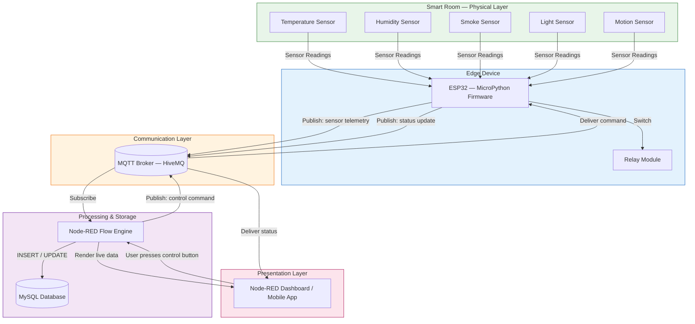
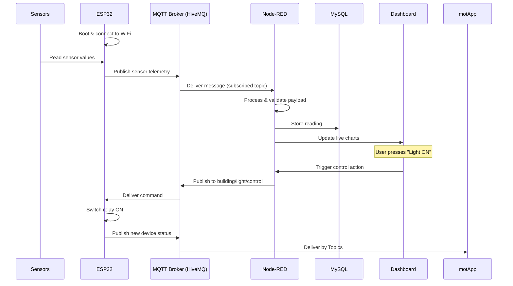

# Smart Building Management System Using IoT

### An End-to-End IoT Solution for Intelligent Room Monitoring & Control

**Monitor. Control. Automate. — A complete, hands-on Smart Building IoT ecosystem built for real-world deployment.**

[Overview](#-overview) •
[Architecture](#-system-architecture) •
[Features](#-project-features) •
[Installation](#-installation-guide) •
[MQTT Topics](#-mqtt-topics) •
[Screenshots](#-screenshots) •
[Roadmap](#-future-improvements)

</div>

---

## Overview

The **Smart Building Management System** is a graduation project that demonstrates a fully functional, production-style **Internet of Things (IoT)** architecture for monitoring and controlling a smart room.

The system is built around an **ESP32 microcontroller** running **MicroPython**, which continuously reads data from a set of environmental and safety sensors. This data is published over the **MQTT protocol** to a **HiveMQ broker**, where it is consumed by **Node-RED**, a powerful flow-based automation engine.

Node-RED is the brain of the system: it processes incoming sensor payloads, persists them into a **MySQL database**, and renders everything on a **live dashboard**. Users can remotely control devices (lights, fans, etc.) directly from the dashboard — commands travel back down through MQTT to the ESP32, which actuates a physical **relay**, then reports its new status back up the chain so the dashboard and mobile application always reflect the real-world state of the room.

> **In short:** Sensors → ESP32 → MQTT → Node-RED → MySQL → Dashboard → back to ESP32. A complete, closed-loop, bidirectional IoT pipeline.

---

##  System Architecture

The architecture follows a classic **Sense → Transmit → Process → Store → Visualize → Control** IoT pipeline, closed by a feedback loop that reports device status back to the user.



### Component Breakdown

<table>
<tr>
<th>Component</th>
<th>Role</th>
<th>Description</th>
</tr>
<tr>
<td><b>Sensors</b></td>
<td>Data Source</td>
<td>Physical devices measuring temperature, humidity, smoke, light, and motion in real time.</td>
</tr>
<tr>
<td><b>ESP32 (MicroPython)</b></td>
<td>Edge Controller</td>
<td>Reads sensor data, publishes it via MQTT, listens for control commands, and drives the relay.</td>
</tr>
<tr>
<td><b>MQTT Broker (HiveMQ)</b></td>
<td>Message Bus</td>
<td>Lightweight publish/subscribe protocol that routes messages between the ESP32 and Node-RED with minimal overhead — ideal for constrained IoT devices.</td>
</tr>
<tr>
<td><b>Node-RED</b></td>
<td>Orchestration Layer</td>
<td>Subscribes to MQTT topics, transforms and validates payloads, writes to MySQL, and drives the dashboard UI.</td>
</tr>
<tr>
<td><b>MySQL Database</b></td>
<td>Persistence Layer</td>
<td>Stores historical sensor readings and device states for analytics and record-keeping.</td>
</tr>
<tr>
<td><b>Relay</b></td>
<td>Actuator</td>
<td>Physically switches connected devices (lights, fans) ON/OFF based on ESP32 commands.</td>
</tr>
</table>

---

## Technologies

<div align="center">

| Category | Technology | Purpose |
|---|---|---|
|  Microcontroller | **ESP32** | Core edge device running the firmware and interfacing with sensors/relay |
|  Firmware Language | **MicroPython** | Lightweight Python runtime for embedded ESP32 development |
|  Messaging Protocol | **MQTT** | Lightweight publish/subscribe communication protocol |
|  Broker | **HiveMQ** | Cloud-hosted MQTT broker connecting ESP32 and Node-RED |
|  Automation Engine | **Node-RED** | Flow-based programming tool for wiring together devices, APIs, and services |
|  Database | **MySQL** | Relational database for persisting sensor and device data |
|  Circuit Simulator | **Wokwi** | Online ESP32 simulator used for prototyping and testing without physical hardware |
|  Network Simulator | **Packet Tracer** | Used to design and validate the network topology |
|  Local Server Stack | **XAMPP** | Provides Apache + MySQL locally for development and testing |
|  Scripting | **Python** | Supporting scripts and backend logic |

</div>

---

##  Project Features

<table>
<tr>
<td width="50%" valign="top">

###  Real-Time Monitoring
-  Temperature Monitoring
-  Humidity Monitoring
-  Smoke Detection
-  Light Detection
-  Motion Detection

</td>
<td width="50%" valign="top">

###  Automation
-  Automatic Lighting
-  Automatic Fan Control
-  Manual Remote Control

</td>
</tr>
<tr>
<td width="50%" valign="top">

###  Dashboard
- Live Charts
- Real-Time Data Visualization
- Remote Device Control Panel

</td>
<td width="50%" valign="top">

###  Data & Communication
- Data Logging
- Database Storage
- MQTT Communication
- Real-Time Synchronization

</td>
</tr>
</table>

---

##  Project Structure

```
Smart-Building-Management-System/
│
├── 📄 README.md                       # Project documentation 
│
├── 📂 DataBase/
│   ├── smart_building_db.sql          # MySQL database schema & tables
│   └── Xampp.txt                      # Notes on XAMPP setup for the local server
│
├── 📂 Docs/
│   ├── Team Structure (Smart Building...)   # Team roles & responsibilities
│   └── Presentation.pptx              # Project presentation slides
│
├── 📂 Images/                          # Screenshots & diagram assets
│
├── 📂 Node-red/
│   └── flows.json                      # Complete Node-RED flow (MQTT, DB, dashboard)
│
├── 📂 Wokwi Esp32/
│   ├── main.py                         # Entry point of the ESP32 firmware
│   ├── config.py                       # WiFi/MQTT credentials & system configuration
│   ├── sensors.py                      # Sensor reading logic
│   ├── mqtt_client.py                  # MQTT connection & pub/sub handling
│   ├── database.py                     # Database helper functions
│   ├── libraries.txt                   # Required MicroPython libraries
│   ├── diagram.json                    # Wokwi circuit diagram definition
│   ├── wokwi-project.txt               # Wokwi project metadata
│   └── Wokwi.txt                       # Notes on running the Wokwi simulation
│
└── 📂 packet_Tracer/
    └── packet tracer (1).pkt           # Network topology simulation file
```

###  File-by-File Explanation

<details>
<summary><b>📂 DataBase/</b> — click to expand</summary>

| File | Description |
|---|---|
| `smart_building_db.sql` | SQL dump defining the database schema — tables for sensor readings, device states, and logs. Import this into MySQL/XAMPP to bootstrap the database. |
| `Xampp.txt` | Link for configuring XAMPP (Apache + MySQL) to host the local database. |

</details>

<details>
<summary><b>📂 Docs/</b> — click to expand</summary>

| File | Description |
|---|---|
| `Team Structure (Smart Building...)` | Document outlining team members and their responsibilities throughout the project. |
| `Presentation.pptx` | Slide deck used to present the project (to be added). |

</details>

<details>
<summary><b>📂 Images/</b> — click to expand</summary>

Contains screenshots of the dashboard, Node-RED flows, Wokwi simulation, database tables, Packet Tracer topology, and system architecture — used throughout this README and project documentation.

</details>

<details>
<summary><b>📂 Node-red/</b> — click to expand</summary>

| File | Description |
|---|---|
| `flows.json` | The complete, importable Node-RED flow. Contains MQTT input/output nodes, function nodes for payload processing, MySQL nodes for persistence, and dashboard UI nodes. |

</details>

<details>
<summary><b>📂 Wokwi Esp32/</b> — click to expand</summary>

| File | Description |
|---|---|
| `main.py` | Entry point of the ESP32 firmware. Initializes WiFi, MQTT, sensors, and starts the main control loop. |
| `config.py` | Contains MQTT broker credentials, WiFi SSID/password, and other system configuration constants. |
| `mqtt_client.py` | Responsible for establishing and maintaining the MQTT connection, and handling publish/subscribe logic. |
| `sensors.py` | Reads and formats values from all connected sensors (temperature, humidity, smoke, light, motion). |
| `database.py` | Helper functions used by the firmware layer for structuring data destined for storage. |
| `libraries.txt` | List of MicroPython libraries/dependencies required to run the firmware. |
| `diagram.json` | Defines the Wokwi virtual circuit — component wiring between the ESP32, sensors, and relay. |
| `wokwi-project.txt` | Metadata describing the Wokwi simulation project. |
| `Wokwi.txt` | Notes and instructions for running and testing the project inside the Wokwi simulator. |

</details>

<details>
<summary><b>📂 packet_Tracer/</b> — click to expand</summary>

| File | Description |
|---|---|
| `packet tracer (1).pkt` | Cisco Packet Tracer file simulating the network topology that connects the smart building devices, illustrating how network infrastructure supports the IoT communication layer. |

</details>

---

##  Complete Data Flow

The diagram below illustrates the full round-trip: from a sensor reading being generated, all the way to a user pressing a button and seeing the device respond.



###  Step-by-Step Breakdown

1. **ESP32 boots** and initializes its peripherals.
2. **Connects to WiFi** using credentials defined in `config.py`.
3. **Reads sensors** — temperature, humidity, smoke, light, and motion.
4. **Publishes MQTT messages** containing the collected sensor data.
5. **HiveMQ Broker receives** the published messages.
6. **Node-RED subscribes** to the relevant MQTT topics.
7. **Node-RED processes** the incoming JSON payload (parsing, validation, transformation).
8. **Stores data in MySQL** for historical logging and analytics.
9. **Updates the Dashboard** with the latest live readings and charts.
10. **User presses "Light ON"** on the dashboard interface.
11. **Node-RED publishes** a command to the `building/light/control` topic.
12. **ESP32 receives the command** via its MQTT subscription.
13. **Relay switches ON**, physically actuating the connected device.
14. **ESP32 publishes** a new device status confirming the action.
15. **MOT MobileApplication** Recive messages by Topics.

---

##  MQTT Topics

All communication in the system is organized around a clear, structured topic hierarchy.

### Published by ESP32 (Telemetry)

| Topic | Payload Example | Purpose |
|---|---|---|
| `building/sensors/temperature` | `{"value": 24.5}` | Publishes current temperature reading |
| `building/sensors/humidity` | `{"value": 55}` | Publishes current humidity reading |
| `building/sensors/smoke` | `{"detected": false}` | Publishes smoke detection status |
| `building/sensors/light` | `{"value": 320}` | Publishes ambient light level |
| `building/sensors/motion` | `{"detected": true}` | Publishes motion detection events |
| `building/light/status` | `{"state": "ON"}` | Reports current light relay state |
| `building/fan/status` | `{"state": "OFF"}` | Reports current fan relay state |

###  Subscribed by ESP32 (Control)

| Topic | Payload Example | Purpose |
|---|---|---|
| `building/light/control` | `{"command": "ON"}` | Receives command to switch the light ON/OFF |
| `building/fan/control` | `{"command": "OFF"}` | Receives command to switch the fan ON/OFF |

###  Subscribed by Node-RED

| Topic Pattern | Purpose |
|---|---|
| `building/sensors/#` | Subscribes to all sensor telemetry for processing and storage |
| `building/+/status` | Subscribes to all device status updates for dashboard sync |

>  **Design Note:** Using a hierarchical topic structure (`building/<domain>/<action>`) makes the system easy to extend — adding a new room or device is as simple as introducing a new topic branch, with no changes required to existing subscribers.

---

##  Installation Guide

Follow this guide from scratch — no prior exposure to the project is required.

### Prerequisites

- A computer with **XAMPP** installed
- A free **HiveMQ Cloud** (or any public MQTT broker) account
- **Node-RED** installed (via `npm install -g node-red` or the desktop installer)
- A **Wokwi** account (free) for ESP32 simulation — or a physical ESP32 board
- **Cisco Packet Tracer** (optional, for network topology review)

---

### Step 1 — Clone the Repository

```bash
git clone https://github.com/<your-username>/Smart-Building-Management-System.git
cd Smart-Building-Management-System
```

### Step 2 — Install XAMPP

1. Download XAMPP from [apachefriends.org](https://www.apachefriends.org/).
2. Install it and launch the **XAMPP Control Panel**.
3. Refer to `DataBase/Xampp.txt` for project-specific configuration notes.

### Step 3 — Import `smart_building_db.sql`

1. Open **phpMyAdmin** (`http://localhost/phpmyadmin`).
2. Create a new database, e.g. `smart_building_db`.
3. Go to the **Import** tab and select `DataBase/smart_building_db.sql`.
4. Click **Go** to create all required tables.

### Step 4 — Start Apache & MySQL

In the XAMPP Control Panel, click **Start** next to both **Apache** and **MySQL**, and confirm both show a green "Running" status.

### Step 5 — Run the MQTT Broker (HiveMQ)

1. Create a free cluster at [HiveMQ Cloud](https://www.hivemq.com/mqtt-cloud-broker/).
2. Note down the **broker URL, port, username, and password**.
3. Update these credentials inside `Wokwi Esp32/config.py`.

### Step 6 — Import the Node-RED Flow

1. Launch Node-RED: `node-red`, then open `http://localhost:1880`.
2. Click the hamburger menu → **Import** → select `Node-red/flows.json`.
3. Update the MQTT broker node with your HiveMQ credentials.
4. Configure the MySQL node with your local XAMPP database credentials.
5. Click **Deploy**.

### Step 7 — Open Wokwi & Import the Circuit

1. Go to [wokwi.com](https://wokwi.com/) and create a new ESP32 project.
2. Import `Wokwi Esp32/diagram.json` to load the circuit layout.
3. Copy the contents of `main.py`, `config.py`, `sensors.py`, `mqtt_client.py`, and `database.py` into the corresponding files in the Wokwi editor.
4. Ensure any required libraries (see `libraries.txt`) are available in the simulation environment.

### Step 8 — Run the ESP32 Simulation

1. Click the green  button in Wokwi.
2. Confirm in the console log that the ESP32 connects to WiFi and to the MQTT broker successfully.

### Step 9 — Open the Dashboard

Navigate to the Node-RED dashboard URL:

```
http://localhost:1880/ui
```

You should see live sensor data begin to populate.

### Step 10 — Test MQTT Communication

Use a tool like [MQTT Explorer](http://mqtt-explorer.com/) to connect to your HiveMQ broker and confirm messages are flowing on the topics listed in the [MQTT Topics](#-mqtt-topics) section.

### Step 11 — Control the Light

From the dashboard, click the **Light ON** button and confirm:
- The Wokwi console shows the command being received.
- The simulated relay/LED switches state accordingly.

### Step 12 — Verify MySQL Updates

Open phpMyAdmin, browse the relevant table (e.g. `sensor_readings`), and confirm new rows are being inserted in real time.

### Step 13 — Verify the Dashboard

Confirm that:
- Live charts are updating.
- The device status buttons reflect the current relay state.
- Data remains synchronized after a page refresh.

 **If all 13 steps pass, your Smart Building Management System is fully operational.**

---

##  How to Run the Project

Once installation is complete, use this quick-start sequence every time you want to run the system:

```bash
# 1. Start local server stack
Open XAMPP Control Panel → Start Apache + MySQL

# 2. Start Node-RED
node-red

# 3. Open the Node-RED editor and confirm the flow is deployed
http://localhost:1880

# 4. Open the dashboard
http://localhost:1880/ui

# 5. Launch the ESP32 simulation in Wokwi (or power on the physical board)
https://wokwi.com

# 6. Interact with the dashboard to monitor sensors and control devices
```


## Future Improvements

-  **TLS** encryption for all MQTT communication
-  **Authentication** and role-based access control for the dashboard
-  **OTA Updates** for remote ESP32 firmware upgrades
-  **AI-based Energy Optimization** to intelligently manage device usage
-  **Cloud Deployment** of Node-RED and MySQL for full remote access
-  **Mobile Notifications** for critical events (e.g. smoke detection)
-  **Multiple Rooms** support with per-room topic namespacing
-  **Energy Analytics** dashboards with historical consumption trends

---

##  Contributing

Contributions are welcome! If you'd like to improve this project:

1. Fork the repository
2. Create a feature branch (`git checkout -b feature/amazing-feature`)
3. Commit your changes (`git commit -m 'Add amazing feature'`)
4. Push to the branch (`git push origin feature/amazing-feature`)
5. Open a Pull Request

---

<div align="center">

Made with Passion as part of a graduation project demonstrating a complete, real-world IoT architecture.

</div>
